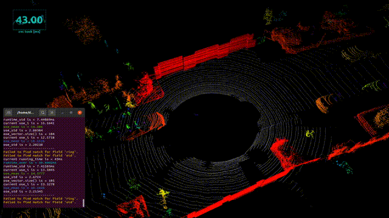

# CVC ROS
An ROS implementation of paper "Curved-Voxel Clustering for Accurate Segmentation of 3D LiDAR Point Clouds with Real-Time Performance"

## Features
* New Spatial Primitive. curved-voxel, a LiDAR-optimized spatial unit reflecting distinct characteristics of 3D LiDAR point clouds. 
* Algorithm. an efficient method for segmenting 3D LiDAR point clouds by utilizing LiDAR-optimized curved-voxels and efficient hashbased data structure.
* ROS dynamic reconfigure, you can tune the parameters easily.

## Reference
* Curved-Voxel Clustering for Accurate Segmentation of 3D LiDAR Point Clouds with Real-Time Performance. (IROS) 2019
* https://github.com/wangx1996/Lidar-Segementation
* https://github.com/SS47816/lidar_obstacle_detector

**TODOs**
* imporove the efficiency of algorithm
* imporove the segmentation accuracy

**Known Issues**
* the segementation result is not very ideal.

## Dependencies
* ground cloud filter: https://github.com/HMX2013/patchwork-VLP16
* sudo apt-get install ros-melodic-jsk-rviz-plugins

## How to use
    # clone the repo
    mkdir -p catkin_ws/src
    cd catkin_ws/src
    git clone https://github.com/HMX2013/SemanticKITTI_loader
    git clone https://github.com/HMX2013/CVC-ROS
    download obsdet_msgs from
    "https://drive.google.com/file/d/1ztLk9Slm656CV-WJieUpBJPlz-Iw14Bk/view?usp=share_link"
    cd ../
    catkin_make
    roslaunch semantic_kitti run_semantic.launch
    roslaunch cvc_ros run_rviz.launch

## Contribution
You are welcome contributing to the package by opening a pull-request

We are following: 
[Google C++ Style Guide](https://google.github.io/styleguide/cppguide.html), 
[C++ Core Guidelines](https://isocpp.github.io/CppCoreGuidelines/CppCoreGuidelines#main), 
and [ROS C++ Style Guide](http://wiki.ros.org/CppStyleGuide)

## License
MIT License
